<p align="center">
  
  
  
  
  
</p>

# 数模 C — MathModel-C

> **面向数学建模竞赛的 MATLAB-first 团队工作流 Skill**
> CUMCM 国赛 A 题 × 三人协作 × AI/Agent 协同 × 证据链驱动

数模 C 是两套成熟工作区的深度融合体：

- **数模 A**（Mrite 体系）提供：CUMCM 中文论文结构、XeLaTeX 模板、物理/工程机理建模方法论 —— 回答 **"论文怎么写、模型怎么建"**
- **数模 B**（mathmodel-skill 体系）提供：阶段化流程、三人角色、状态持久化、独立门禁质检、复现清单 —— 回答 **"比赛怎么管、结果怎么验"**
- **数模 C 自研**：MATLAB-first 工具链、AI/Agent 协作协议、统一 CLI、证据链自动化 —— 回答 **"队伍怎么用 AI 而不被 AI 带偏"**

**核心理念：人定模型，MATLAB 求解，Agent 加速，结果锁定，论文落地。**

---

## 📌 它能解决什么问题

数模比赛失败很少因为"缺少更聪明的算法"，更多是流程失控：

| 常见翻车现场 | 数模 C 的对策 |
|---|---|
| 三人各做各的，论文和代码对不上 | `主张—证据表`：每个结论绑定公式+代码+结果文件 |
| 摘要数字来自旧版本结果 | `结果版本绑定`：manifest 变化自动把相关主张打回 REVIEW |
| 模型假设写了但没进方程 | `假设闭环矩阵`：每条假设必须映射到模型组件与检验 |
| 图做了一堆，不知道证明什么 | `图表契约`：每张图先登记主张、数据源、正文位置 |
| AI 写了一大篇漂亮的空话 | `MISSING_EVIDENCE` 机制：缺证据禁止编造数字 |
| 把局部最优写成全局最优 | 表达控制器：无证明只能用"当前搜索范围内最优候选" |
| 临近交卷才发现匿名/页数/AI披露不合规 | `CUMCM终审清单`：规则、匿名、AI披露逐项勾选 |

---

## 🚀 快速开始

### 环境要求

| 依赖 | 版本 | 用途 | 必需性 |
|---|---|---|---|
| Python | 3.10+ | CLI 工具链（纯标准库，无第三方包） | ✅ 必需 |
| XeLaTeX | TeX Live 2023+ | CUMCM 中文论文编译 | ✅ 必需 |
| MATLAB | R2020+ | 主求解/仿真/绘图 | ✅ 必需 |
| pandoc 或 wkhtmltopdf | 任意 | AI 使用详情 PDF | ⚠️ 可选 |

### 三步启动

```bash
# 1. 克隆并准备字体（模板使用思源宋体 OFL + Windows 系统字体，均不入库）
git clone https://github.com/Pluto207/MathModel-C.git
cd MathModel-C
python tools/fonts/fetch_sourcehan.py    # 下载思源宋体（OFL 协议，需联网）
python tools/fonts/setup_fonts.py        # Windows 下自动从 C:\Windows\Fonts 复制

# 2. 自检
python tools/c.py self-check

# 3. 初始化一道比赛题
python tools/c.py init 2026国赛-A题 --questions 4
```

初始化后：题目放入 `题目/`，附件放入 `数据/`，填写 `团队分工.md` 与各问 `求解/问题X/模型合同.md`，然后按主工作流推进。

---

## 🧭 主工作流

```mermaid
graph LR
    A[Stage 0 启动与环境冻结] --> B[Stage 1 选题]
    B --> C[Stage 2 拆题]
    C --> D[Stage 3 模型选型]
    D --> E[Stage 4 模型合同 🔒]
    E --> F[Stage 5 MATLAB 求解]
    F --> G[Stage 6 稳健性检验]
    G --> H[Stage 7 评价与推广]
    H --> I[Stage 8 论文装配]
    I --> J[Stage 9 终审提交]
    F -.MISSING_EVIDENCE.-> E
    I -.结果变化自动打回.-> H
```



### 四个比赛硬门

| 门禁 | 名称 | 通过条件 |
|---|---|---|
| **M 门** | 模型合同门 | 每问输入/输出/变量/假设/目标/约束/验证齐全并 APPROVED |
| **R 门** | MATLAB 运行门 | 主入口独立运行，产生真实结果 + 至少一张有意义的图 |
| **E 门** | 证据门 | 论文数字/公式/代码/结果/图表一致且可复现 |
| **W 门** | 交付门 | 结构/格式/匿名/AI披露/支撑材料符合当届官方规则 |

### 三人分工

| 角色 | 主责 | 必交付 |
|---|---|---|
| 🧠 建模主 | 题意、机理、假设、方程、模型取舍 | `题目分析报告`、每问 `模型合同` |
| 💻 MATLAB 主 | 数据、函数、求解、实验、图表、复现 | `main_qX.m`、结果 CSV/MAT/JSON、图表 |
| ✍️ 论文主 | 符号统一、证据链、LaTeX、合规终审 | `论文/论文.tex` → PDF、主张—证据表 |

**AI/Agent 定位**：分析加速器、代码协作者、只读审查者、反方审稿人——**不是第四名队员**。核心假设、关键数字、最终提交由队员裁决。

---

## 🛠 CLI 工具一览

所有检查默认**只读**，不修改项目文件（除非显式 `--apply`）。

```bash
python tools/c.py init 2026国赛-A题 --questions 4   # 初始化项目（含论文模板+每问合同+MATLAB入口）
python tools/c.py check 2026国赛-A题                 # 目录/状态/规则核对检查
python tools/c.py evidence 2026国赛-A题               # 主张—证据表：状态词/路径/审核人
python tools/c.py bind 2026国赛-A题                   # 结果 manifest 与主张绑定
python tools/c.py version 2026国赛-A题 [--apply]      # 结果版本变化检测 → 自动打回 REVIEW
python tools/c.py figure 2026国赛-A题                 # 图表契约检查
python tools/c.py paper 2026国赛-A题                  # 论文占位符/证据表检查
python tools/c.py ai-report 2026国赛-A题 [--pdf]      # 生成 AI 使用详情（Markdown/PDF）
python tools/c.py self-check                          # Skill 自检
```

### MATLAB 工具（`tools/matlab/`）

```matlab
check_matlab_env()          % 环境与工具箱预检
save_result_bundle(...)     % 结果固化：.mat + .txt + .json manifest
check_nan_inf(x)            % NaN/Inf 检查
check_constraints(...)      % 边界/线性约束检查
compare_baseline(...)       % 主模型 vs 基线对比
run_sensitivity(...)        % 参数敏感性扫描
```

---

> **📄 给队友：[部署说明](给队员的部署说明.md) ｜ 赛前必查：[规则核对清单](docs/比赛前规则核对清单.md)**

---

## 📂 目录结构

```text
MathModel-C/
├── SKILL.md                 # 唯一主入口（运行时规则）
├── references/              # 方法论
│   ├── stages/              #   Stage 0–9 + 训练/比赛模式
│   ├── roles/               #   建模主 / MATLAB主 / 论文主
│   ├── writing/             #   高分表达控制（源自2016-2019优秀论文分析）
│   ├── structure/           #   论文结构、图表叙事、递进式建模
│   ├── validation/          #   假设闭环、鲁棒性与敏感性
│   ├── ai/                  #   AI使用协议、Agent分工、提示词模板
│   └── compliance/          #   CUMCM终审清单
├── templates/               # CUMCM 中文论文模板（XeLaTeX）
├── tools/                   # Python/MATLAB 工具链 + c.py 统一入口
├── assets/                  # 算法资料（优化/预测/评价/统计/图论/ML）
├── competitions/cumcm/      # 规则、写作启发、反模式
├── case_patterns/           # 优秀论文范式报告 + 案例卡片
├── upgrade/                 # Prompt/结构/检验升级方案 + Action Items
├── LICENSE                  # MIT
└── THIRD_PARTY_NOTICES.md   # 上游来源与许可
```

---

## 📚 内含的高分方法论（源自历年优秀论文分析）

对 2016–2019 传统优秀论文（AI 普及前、"更有人味"的高分写作）做了系统性归纳，已固化为 Skill 内的写作/结构/检验规则：

- **摘要**：研究对象 → 难点 → 模型 → 求解 → 核心结果 → 验证/边界
- **结果段**：数值结果 → 对照对象 → 变化原因 → 决策含义
- **假设**：每条必须映射到方程/约束/边界（假设闭环矩阵）
- **灵敏度**：回答"为何选它、扰动来源、敏感方向、稳定区间、决策是否改变"
- **禁语**：无证据的"全局最优 / 完全吻合 / 显著提升 / 强普适性"

内置案例卡片：2016 系泊系统 · 2017 CT 标定 · 2018 高温服装 · 2018 RGV 调度 · 2019 高压油管 · 2023 定日镜场。

---

## ⚖️ 许可与致谢

- 本项目代码与文档：**MIT License**（见 [LICENSE](LICENSE)）
- 上游与第三方：见 [THIRD_PARTY_NOTICES.md](THIRD_PARTY_NOTICES.md)
  - [Mrite](https://github.com/Rzna-5559/Mrite)（MIT）：论文模板与工作区方法论
  - mathmodel-skill（MIT, © rootkiller6788）：流程/门禁/规则内核
  - [Source Han Serif](https://github.com/adobe-fonts/source-han-serif)（SIL OFL-1.1）：论文中文字体
  - Windows 系统字体（Times/Arial/SimKai/Consolas）不可再分发，由本机生成

## ⚠️ 免责声明

1. 竞赛规则具有时效性，**提交前以当届官方文件为准**；本仓库规则包仅作核对辅助。
2. MATLAB 实机运行与端到端演练需在有 MATLAB 的机器上执行。
3. 案例分析是可迁移观察，**不是官方评分标准**，请勿复制示例论文结论。
4. AI 输出必须人工复核；关键建模决策由队员作出，责任在队伍自身。

---

<p align="center"><b>愿每支队伍都能写出证据扎实、逻辑干净、读起来像人写的论文。</b></p>
